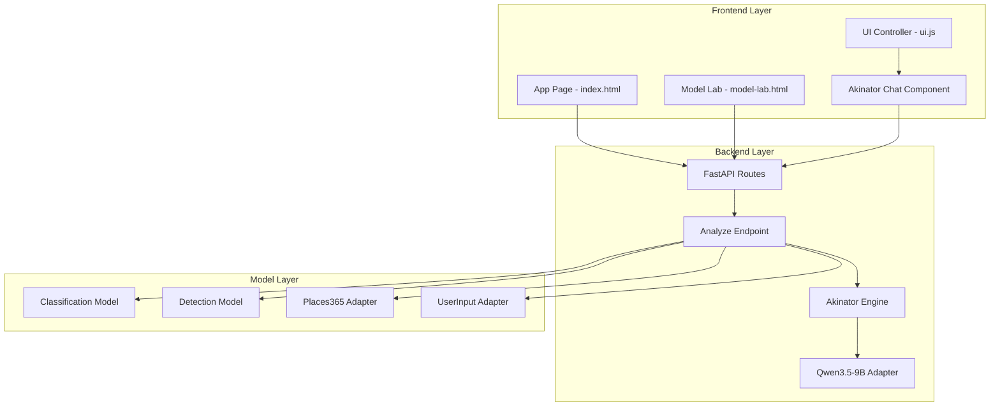
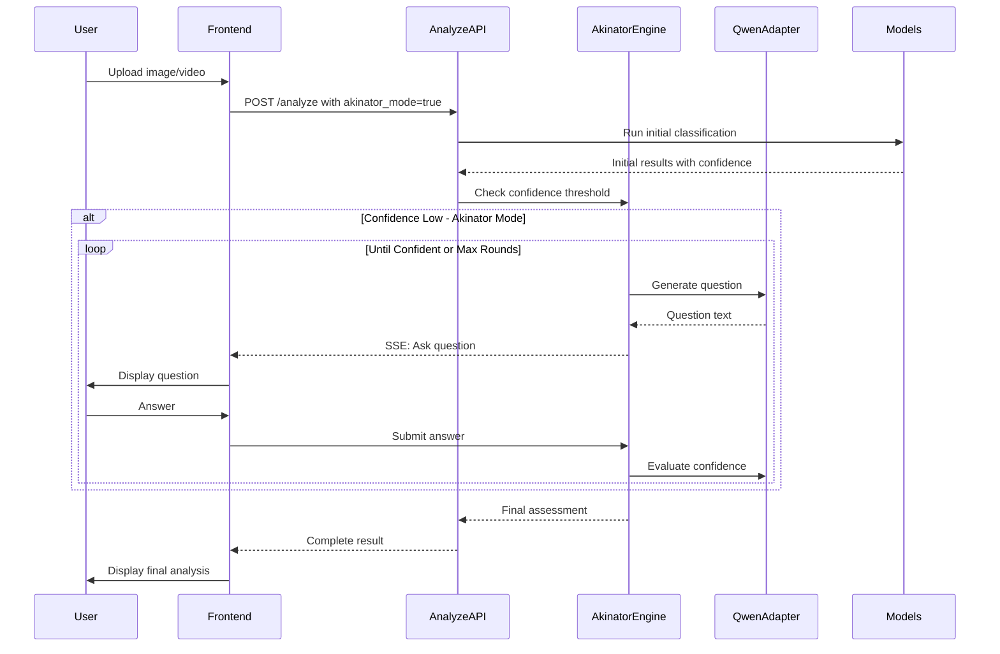

# HydroScan Redesign & Akinator Mode Implementation Plan

## Confirmed Design Decisions

| Decision | Choice |
|----------|--------|
| App Page Background | Particles only (no video) - subtle and not distracting |
| Akinator Mode Default | ON (checked by default) |
| Hardware | GPU available for Qwen3.5-9B |
| Max Question Rounds | 10 rounds maximum |
| History Tab | Visual redesign only (no new features) |

## Overview

This plan outlines the implementation of a major redesign and feature enhancement for the HydroScan water quality analysis web application. The key features include:

1. **UI Consistency** - Apply premium home.html styling to app page and model-lab
2. **Akinator-Style Inference** - Interactive back-and-forth questioning until AI is confident
3. **Qwen3.5-9B Integration** - Local LLM for intelligent questioning
4. **Location Disable** - Gray out location features temporarily
5. **History Redesign** - Premium styling for history section
6. **Timeline Improvement** - Better initial inference display

---

## Architecture Diagram



---

## 1. UI Redesign - App Page (index.html)

### Current State

- Uses main.css with card-based layout
- Has form, timeline, history, results, debug sections
- Location inputs are active
- Different visual style from home.html

### Target Design Elements from home.html

- Video background with particles animation
- Glass-morphism cards with `backdrop-filter: blur`
- CSS Variables: `--primary: #00d4ff`, `--accent: #00ff88`, `--dark: #0a0a0f`
- Gradient buttons with hover animations
- Animated particle system

### Implementation Steps

1. Extract CSS from home.html into shared stylesheet
2. Add video background component to index.html
3. Convert cards to glass-morphism style
4. Update form styling with gradient inputs
5. Add subtle animations and hover effects
6. Ensure responsive design is maintained

### Key CSS Classes to Create

```css
/* Shared premium styles */
.video-background { }
.particles { }
.glass-card {
  background: rgba(10, 10, 15, 0.72);
  backdrop-filter: blur(24px);
  border: 1px solid rgba(0, 212, 255, 0.15);
}
.cta-button {
  background: linear-gradient(135deg, #00d4ff, #00ff88);
  transition: transform 0.3s ease, box-shadow 0.3s ease;
}
```

---

## 2. UI Redesign - Model Lab (model-lab.html)

### Current State

- Inline styles with basic card design
- Model selector buttons
- Test form and results display

### Implementation Steps

1. Apply same glass-morphism styling as index.html
2. Add header consistent with app page
3. Update model selector buttons with gradient styling
4. Style results cards to match premium theme
5. Add loading animations

---

## 3. Location Feature Disable

### Files to Modify

- `WebInterface/frontend/templates/index.html` - Lines 59-84
- `WebInterface/frontend/static/js/ui.js` - handleLocate function
- `WebInterface/API/analyze.py` - Location fetching logic

### Implementation Steps

1. Add `disabled` attribute to location inputs
2. Apply grayed-out styling with reduced opacity
3. Disable geolocation button
4. Add tooltip explaining feature is coming soon
5. Skip location-related processing in backend

### Code Changes

```html
<!-- Gray out location inputs -->
<div class="grid two location-disabled">
  <label class="field">
    <span>Latitude</span>
    <input type="number" step="any" name="lat" disabled 
           class="disabled-input" title="Location feature coming soon">
  </label>
  ...
</div>
```

```css
.location-disabled {
  opacity: 0.4;
  pointer-events: none;
}
```

---

## 4. History Tab Redesign

### Current State

- Basic list items in main.css lines 130-279
- Shows analysis ID, timestamp, and brief result

### Implementation Steps

1. Redesign as premium cards with glass-morphism
2. Add thumbnail previews
3. Improve typography and spacing
4. Add hover animations
5. Consider expandable details view

### Design Mockup Structure

```html
<div class="history-item glass-card">
  <div class="history-thumbnail">
    
  </div>
  <div class="history-info">
    <span class="history-date">Mar 3, 2026 - 14:30</span>
    <h4 class="history-title">Clean Water Analysis</h4>
    <div class="history-score">Score: 87%</div>
  </div>
  <div class="history-actions">
    <button class="view-btn">View Details</button>
  </div>
</div>
```

---

## 5. Qwen3.5-9B Adapter Creation

### File to Create

`WebInterface/backend/Adapters/QwenAdapter.py`

### Implementation

```python
from huggingface_hub import snapshot_download
import os
from typing import Optional, Dict, Any, List

class QwenAdapter:
    """Local LLM adapter using Qwen3.5-9B for Akinator-style questioning."""
    
    def __init__(self):
        self.model_dir = "models/qwen3.5-9b"
        self.model = None
        self.tokenizer = None
        
    def ensure_model_exists(self) -> str:
        """Download model if not present."""
        if not os.path.exists(self.model_dir):
            snapshot_download(
                repo_id="Qwen/Qwen3.5-9B",
                local_dir=self.model_dir,
                local_dir_use_symlinks=False
            )
        return self.model_dir
    
    def load(self) -> bool:
        """Load model into memory."""
        try:
            from transformers import AutoModelForCausalLM, AutoTokenizer
            model_path = self.ensure_model_exists()
            self.tokenizer = AutoTokenizer.from_pretrained(model_path)
            self.model = AutoModelForCausalLM.from_pretrained(
                model_path,
                torch_dtype="auto",
                device_map="auto"
            )
            return True
        except Exception as e:
            print(f"Failed to load Qwen model: {e}")
            return False
    
    def generate_question(
        self,
        context: Dict[str, Any],
        conversation_history: List[Dict[str, str]]
    ) -> str:
        """Generate next Akinator-style question based on context."""
        prompt = self._build_prompt(context, conversation_history)
        # Generate response using model
        # Return question string
        pass
    
    def evaluate_confidence(
        self,
        context: Dict[str, Any],
        answers: List[Dict[str, str]]
    ) -> Dict[str, Any]:
        """Evaluate if confidence threshold is met for final answer."""
        pass
    
    def _build_prompt(
        self,
        context: Dict[str, Any],
        history: List[Dict[str, str]]
    ) -> str:
        """Build prompt for water quality questioning."""
        return f"""You are a water quality analysis assistant. Based on the 
        following analysis context, ask targeted yes/no questions to determine 
        water quality status.
        
        Current observations:
        {context}
        
        Previous Q&A:
        {history}
        
        Ask the most informative next question to narrow down water quality 
        assessment. Focus on: smell, color, clarity, source, recent weather, 
        surrounding environment."""
```

---

## 6. Akinator-Style Inference System

### Architecture Flow



### Backend Implementation

#### New Endpoint for Akinator Flow

`WebInterface/API/akinator.py`

```python
from fastapi import APIRouter, Request
from fastapi.responses import StreamingResponse
from pydantic import BaseModel
from typing import Optional, List, Dict, Any

router = APIRouter(prefix="/api/akinator", tags=["akinator"])

class AkinatorAnswer(BaseModel):
    session_id: str
    question_id: int
    answer: str  # yes/no/text
    additional_text: Optional[str] = None

class AkinatorSession(BaseModel):
    session_id: str
    initial_context: Dict[str, Any]
    confidence_threshold: float = 0.85
    max_rounds: int = 10
    current_round: int = 0
    conversation: List[Dict[str, str]] = []
    final_result: Optional[Dict[str, Any]] = None

# In-memory session store (consider Redis for production)
sessions: Dict[str, AkinatorSession] = {}

@router.post("/start")
async def start_akinator_session(analysis_id: str):
    """Start new Akinator session from completed initial analysis."""
    pass

@router.post("/answer")
async def submit_answer(answer: AkinatorAnswer):
    """Submit answer and get next question or final result."""
    pass

@router.get("/session/{session_id}")
async def get_session_state(session_id: str):
    """Get current session state for reconnection."""
    pass
```

### Confidence Threshold Logic

```python
CONFIDENCE_THRESHOLDS = {
    "high_confidence": 0.85,  # Ready to give final answer
    "medium_confidence": 0.60,  # Need 1-2 more questions
    "low_confidence": 0.40,  # Need detailed questioning
}

def should_continue_questioning(
    current_confidence: float,
    rounds_elapsed: int,
    max_rounds: int = 10
) -> bool:
    """Determine if Akinator should continue questioning."""
    if rounds_elapsed >= max_rounds:
        return False  # Force final answer
    if current_confidence >= CONFIDENCE_THRESHOLDS["high_confidence"]:
        return False  # Confident enough
    return True  # Continue questioning
```

---

## 7. Frontend Akinator UI Components

### HTML Structure for Chat Component

Add to index.html:

```html
<!-- Akinator Chat Modal/Panel -->
<div class="akinator-panel hidden" id="akinator-panel">
  <div class="akinator-header">
    <h3>Water Quality Analysis</h3>
    <span class="akinator-round">Round <span id="akinator-round-num">1</span>/10</span>
  </div>
  
  <div class="akinator-chat" id="akinator-chat">
    <!-- Messages will be inserted here -->
  </div>
  
  <div class="akinator-input">
    <div class="quick-answers">
      <button class="answer-btn" data-answer="yes">Yes</button>
      <button class="answer-btn" data-answer="no">No</button>
      <button class="answer-btn" data-answer="maybe">Not Sure</button>
    </div>
    <div class="text-answer">
      <input type="text" id="akinator-text-input" 
             placeholder="Describe in detail...">
      <button id="akinator-submit">Send</button>
    </div>
  </div>
</div>
```

### CSS Styling

```css
.akinator-panel {
  position: fixed;
  bottom: 0;
  right: 20px;
  width: 400px;
  max-height: 500px;
  background: rgba(10, 10, 15, 0.95);
  backdrop-filter: blur(24px);
  border: 1px solid rgba(0, 212, 255, 0.2);
  border-radius: 16px 16px 0 0;
  overflow: hidden;
  z-index: 1000;
}

.akinator-chat {
  height: 300px;
  overflow-y: auto;
  padding: 16px;
}

.chat-message {
  margin-bottom: 12px;
  padding: 12px 16px;
  border-radius: 12px;
  max-width: 80%;
}

.chat-message.bot {
  background: linear-gradient(135deg, rgba(0, 212, 255, 0.2), rgba(0, 255, 136, 0.1));
  border: 1px solid rgba(0, 212, 255, 0.3);
  margin-right: auto;
}

.chat-message.user {
  background: rgba(0, 255, 136, 0.2);
  border: 1px solid rgba(0, 255, 136, 0.3);
  margin-left: auto;
}
```

### JavaScript Handler

Add to ui.js:

```javascript
class AkinatorController {
  constructor() {
    this.sessionId = null;
    this.currentRound = 0;
    this.isActive = false;
  }

  async startSession(analysisId) {
    const response = await fetch('/api/akinator/start', {
      method: 'POST',
      headers: { 'Content-Type': 'application/json' },
      body: JSON.stringify({ analysis_id: analysisId })
    });
    const data = await response.json();
    this.sessionId = data.session_id;
    this.isActive = true;
    this.showPanel();
    this.addMessage(data.first_question, 'bot');
  }

  async submitAnswer(answer, additionalText = null) {
    this.addMessage(answer, 'user');
    
    const response = await fetch('/api/akinator/answer', {
      method: 'POST',
      headers: { 'Content-Type': 'application/json' },
      body: JSON.stringify({
        session_id: this.sessionId,
        question_id: this.currentRound,
        answer: answer,
        additional_text: additionalText
      })
    });
    
    const data = await response.json();
    this.currentRound = data.current_round;
    this.updateRoundDisplay();
    
    if (data.is_complete) {
      this.showFinalResult(data.final_result);
    } else {
      this.addMessage(data.next_question, 'bot');
    }
  }

  showPanel() {
    document.getElementById('akinator-panel').classList.remove('hidden');
  }

  hidePanel() {
    document.getElementById('akinator-panel').classList.add('hidden');
  }

  addMessage(text, sender) {
    const chat = document.getElementById('akinator-chat');
    const msg = document.createElement('div');
    msg.className = `chat-message ${sender}`;
    msg.textContent = text;
    chat.appendChild(msg);
    chat.scrollTop = chat.scrollHeight;
  }

  updateRoundDisplay() {
    document.getElementById('akinator-round-num').textContent = this.currentRound;
  }

  showFinalResult(result) {
    // Display final water quality assessment
    this.addMessage(`Analysis Complete: ${result.quality_status}`, 'bot');
    this.addMessage(`Confidence: ${result.confidence * 100}%`, 'bot');
    setTimeout(() => this.hidePanel(), 3000);
  }
}
```

---

## 8. Timeline Improvement for Initial Inference

### Current Implementation

- Timeline updates via SSE during analysis
- Shows model loading, classification, detection steps

### Enhancement Plan

1. Add progress percentages for each stage
2. Show estimated time remaining
3. Display intermediate results more prominently
4. Add visual feedback for confidence levels
5. Improve transition to Akinator mode

### Updated Timeline HTML

```html
<ul class="timeline enhanced" id="timeline">
  <li class="timeline-item" data-stage="init">
    <div class="timeline-icon">...</div>
    <div class="content">
      <span class="stage-name">Initializing</span>
      <div class="progress-bar"><div class="progress" style="width: 0%"></div></div>
    </div>
  </li>
  <li class="timeline-item" data-stage="classification">
    <div class="timeline-icon">...</div>
    <div class="content">
      <span class="stage-name">Classification</span>
      <span class="stage-result" id="cls-result"></span>
      <div class="confidence-indicator">
        <span class="confidence-value">0%</span>
      </div>
    </div>
  </li>
  <!-- More stages -->
</ul>
```

---

## 9. Smell Question Integration

### Smell Input Options

1. **Initial Form** - Add optional smell description textarea
2. **Akinator Questions** - Specific smell-related questions

### Smell Keywords for Analysis

Based on scoring.py patterns, detect:

- `chlorine` - Municipal water treatment
- `sulfur/rotten eggs` - Bacterial contamination
- `earthy/musty` - Algae or organic matter
- `metallic` - Pipe corrosion or iron
- `sewage` - Contamination
- `chemical` - Industrial pollution

### Backend Integration

```python
SMELL_MAPPINGS = {
    "chlorine": {"factor": -0.1, "context": "treated_water"},
    "sulfur": {"factor": -0.3, "context": "bacterial"},
    "rotten eggs": {"factor": -0.3, "context": "bacterial"},
    "earthy": {"factor": -0.15, "context": "organic"},
    "musty": {"factor": -0.15, "context": "algae"},
    "metallic": {"factor": -0.2, "context": "corrosion"},
    "sewage": {"factor": -0.4, "context": "contamination"},
    "chemical": {"factor": -0.25, "context": "pollution"},
}

def process_smell_input(smell_description: str) -> Dict[str, Any]:
    """Process smell description and return scoring adjustment."""
    smell_lower = smell_description.lower()
    for keyword, mapping in SMELL_MAPPINGS.items():
        if keyword in smell_lower:
            return {
                "detected_smell": keyword,
                "quality_factor": mapping["factor"],
                "context": mapping["context"]
            }
    return {"detected_smell": None, "quality_factor": 0, "context": None}
```

---

## 10. Form Changes - Akinator Toggle

### Updated Form Section

```html
<form id="analyze-form" autocomplete="off">
  <!-- Existing file and description fields -->
  
  <!-- Akinator Mode Toggle -->
  <label class="checkbox akinator-toggle">
    <input type="checkbox" name="akinator_mode" id="akinator-mode" checked>
    <span class="checkmark"></span>
    <span class="label-text">Akinator Mode - Interactive Analysis</span>
    <span class="tooltip" title="AI will ask follow-up questions for better accuracy">?</span>
  </label>
  
  <!-- Smell Input -->
  <label class="field smell-field">
    <span>Water Smell Description (optional)</span>
    <select name="smell_type" id="smell-type">
      <option value="">No noticeable smell</option>
      <option value="chlorine">Chlorine / Swimming pool</option>
      <option value="sulfur">Sulfur / Rotten eggs</option>
      <option value="earthy">Earthy / Musty</option>
      <option value="metallic">Metallic</option>
      <option value="sewage">Sewage</option>
      <option value="chemical">Chemical</option>
      <option value="other">Other (describe below)</option>
    </select>
  </label>
  
  <label class="field smell-detail hidden" id="smell-detail-field">
    <span>Describe the smell</span>
    <textarea name="smell_description" placeholder="Describe any unusual smell..."></textarea>
  </label>
  
  <!-- Location disabled -->
  <div class="location-section disabled" title="Feature coming soon">
    <span class="disabled-notice">Location features coming soon</span>
    <!-- Grayed out inputs -->
  </div>
</form>
```

---

## Implementation Priority Order

### Phase 1: UI Foundation

1. Extract shared styles from home.html
2. Redesign index.html with premium styling
3. Update model-lab.html styling
4. Disable location features
5. Redesign history section

### Phase 2: Backend Infrastructure

1. Create QwenAdapter class
2. Implement model download/loading
3. Create akinator.py API endpoints
4. Add smell processing logic
5. Implement confidence threshold system

### Phase 3: Frontend Integration

1. Add Akinator toggle to form
2. Create chat panel component
3. Implement AkinatorController JavaScript
4. Update timeline display
5. Connect SSE events for real-time updates

### Phase 4: Testing & Polish

1. End-to-end testing
2. Performance optimization
3. Error handling
4. User feedback integration
5. Documentation

---

## File Changes Summary

| File | Changes |
|------|---------|
| `WebInterface/frontend/templates/index.html` | Premium styling, Akinator toggle, smell input, chat panel, disabled location |
| `WebInterface/frontend/templates/model-lab.html` | Premium styling update |
| `WebInterface/frontend/templates/home.html` | Extract CSS to shared file |
| `WebInterface/frontend/static/css/main.css` | Glass-morphism, animations, new components |
| `WebInterface/frontend/static/js/ui.js` | AkinatorController, timeline updates, disabled location |
| `WebInterface/backend/Adapters/QwenAdapter.py` | NEW - Local LLM adapter |
| `WebInterface/API/akinator.py` | NEW - Akinator endpoints |
| `WebInterface/API/analyze.py` | Integration with Akinator system |
| `WebInterface/app.py` | Register new routes |

---

## Questions for Clarification

Before proceeding with implementation, I need clarification on:

1. **Video Background** - Should the video background from home.html be used on the app page, or would that be too distracting during analysis?

2. **Akinator Mode Default** - Should Akinator mode be enabled by default (checked) or disabled by default?

3. **Max Questions** - Is 10 rounds a good maximum for Akinator questioning, or should it be fewer/more?

4. **Offline LLM** - Is the Qwen3.5-9B model expected to run on CPU, or is GPU available? This affects response time and model loading strategy.

5. **History Storage** - Should history redesign include any new features like filtering, search, or just visual redesign?
